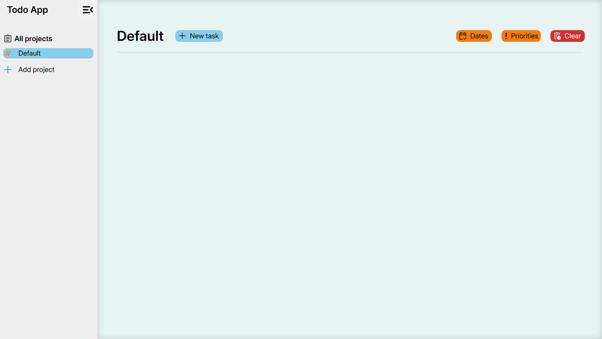

# todo-app

Use it yourself -> https://fromscode.github.io/todo-app/

## Screenshots

When you open for the first time:



Adding tasks:


Multiple projects and tasks


Note: There is no dedicated backend, I am using browser's local storage to provide some sort of persistence. As long as you use the same browser to access the app, you don't need to worry.

In case you want to run this on your local machine, follow these steps:

## Clone
```bash
git clone git@github.com:fromscode/todo-app.git
cd todo-app
```

or (if you don't have SSH configured)
```bash
git clone https://github.com/fromscode/todo-app.git
cd todo-app
```

## Setup
Install dependencies:
```bash
npm install
```

Run in development mode:
```bash
npm run dev
```
Unless port 8080 is occupied, it will run on port 8080.

Quick link to open it: http://localhost:8080/

If you cannot connect, it probably means the app is running on some other port. Checking on your IDE logs will help you identify which port the app is running on

## Prod
If you want to bundle up the final dist directory:
```bash
npm run build
```
Note: This does not automatically run the app, you might have to open it using a live server (In case you are using VS-Code as your IDE, you can right-click on the index.html file inside the dist/ folder and select Open with Live Server option. In case you don't find this try the shortcut: Alt + L Alt + O. If still nothing, then you probably need to install the live server extension.)

## Issues
In case you find a bug, or have some general feedback, [Raise an issue](https://github.com/fromscode/todo-app/issues/new)

If you have read this far, click here to get a cookie 😄 -> [Click Here](https://www.youtube.com/watch?v=dQw4w9WgXcQ&list=RDdQw4w9WgXcQ&start_radio=1)